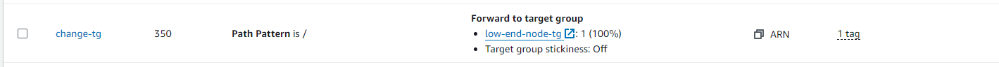
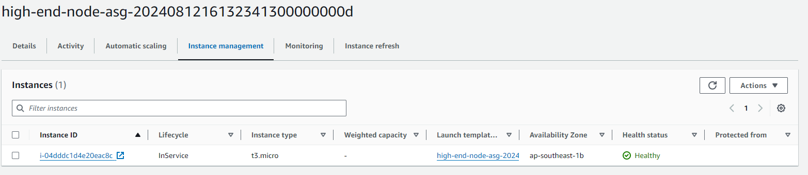
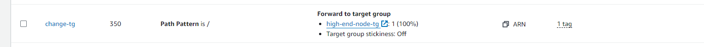
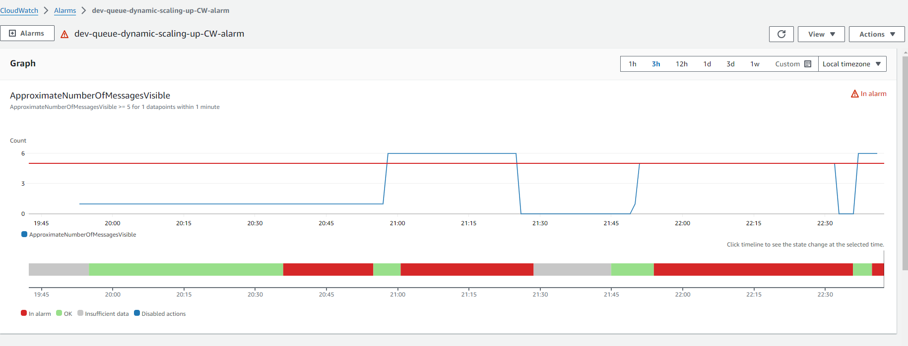
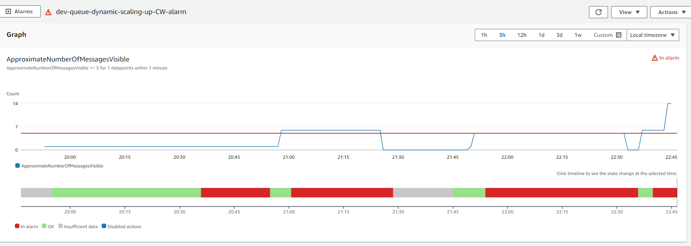
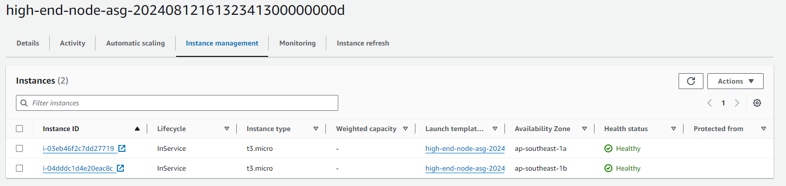

# snaptrude-devops-assignment

## Assumptions
1. SQS, ALB, Target groups, Listener Rule are already created and are in place.
2. Application is auto deployed into nodes.
3. There are 2 different target groups for low-end and high-end node ASGs.

## Working
By default,when there is no load the ALB rule points to the low-end node target group. 

The number of messages in the SQS queue will be monitored via cloudwatch metric. 
Whenever the number of messages in the SQS will go beyond 5, it will breach the alarm and will trigger an SNS topic which in turn will trigger a lambda to change the listener to forward to the high-end node target group and will increase the node count to 1.

Whenever the number of messages in the SQS will go beyond 10, it will increase the node count to 2.

Whenever the number of messages go below 5 it will trigger another SNS topic which in turn will trigger a lambda to change the listener to forward to the low-end node target group and bring back the high end node ASG count to 0.

